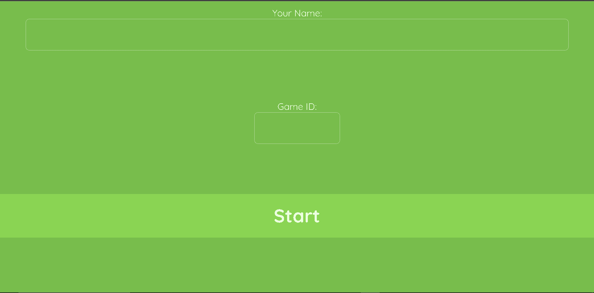
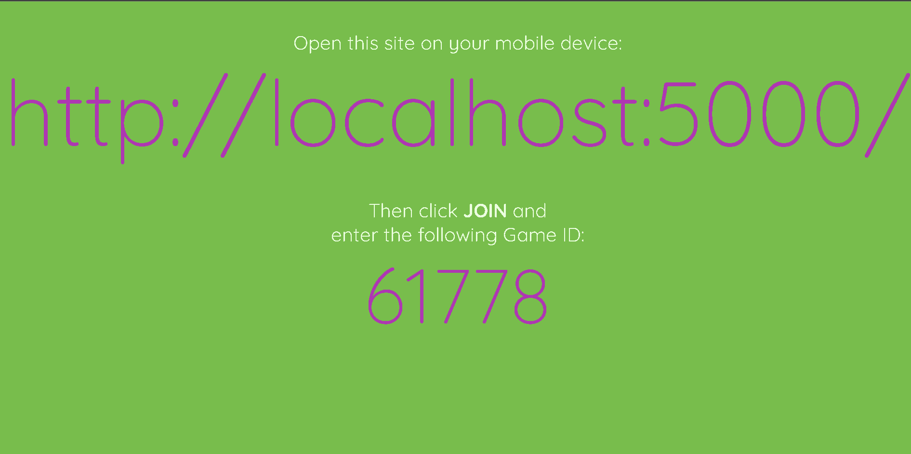
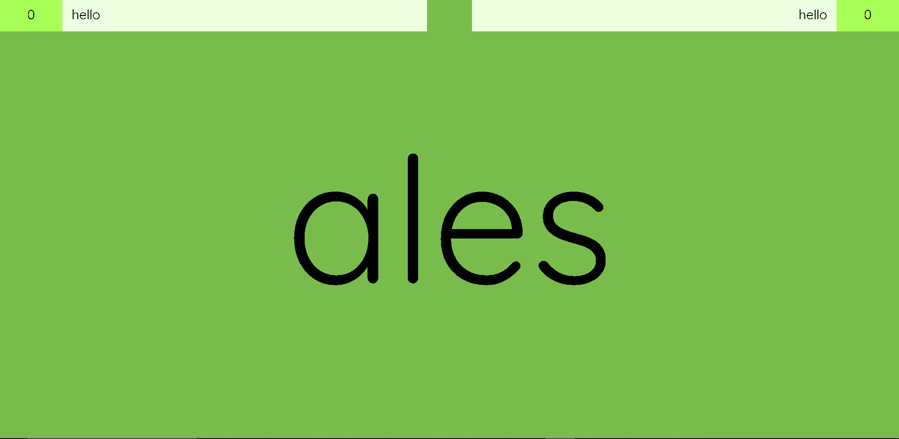
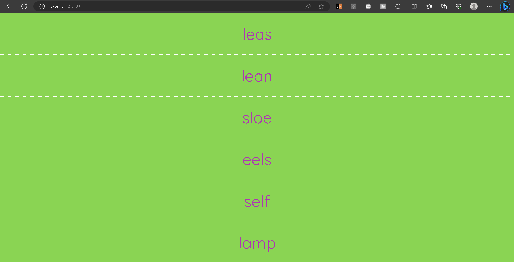

# Socket-io-anagram

The Socket Anagram Game is an interactive and engaging multiplayer word game built using HTML, CSS, JavaScript, and Socket.IO for real-time communication. The game allows players to compete against each other by solving anagrams – rearranging letters to form meaningful words – in a fast-paced and fun environment.

In this multiplayer game, players are divided into two roles: the Host, responsible for creating and managing game sessions, and the Players, who join the hosted game to participate. The game leverages the power of Socket.IO, a real-time event-based communication library, to establish seamless connections between players and the game server, enabling instant updates and interactions.

The Host initiates the game, generating unique game IDs and providing the Players with a link to join. Once players join the game, they wait for the Host to start a round. During each round, the Host presents a set of scrambled words, and Players must quickly select the correct unscrambled word from the given options. They compete against each other to answer correctly and swiftly, adding a sense of excitement and competitiveness to the gameplay.

Socket programming is the core foundation of this project, enabling bidirectional communication between the client-side and server-side in real-time. Players' actions, such as answering a word or restarting the game, are instantly transmitted to all connected clients, making the gameplay immersive and dynamic.

Overall, the Socket Anagram Game is a captivating example of how socket programming can enhance the multiplayer gaming experience, providing players with an interactive and thrilling word challenge while ensuring seamless and instantaneous communication between participants.

